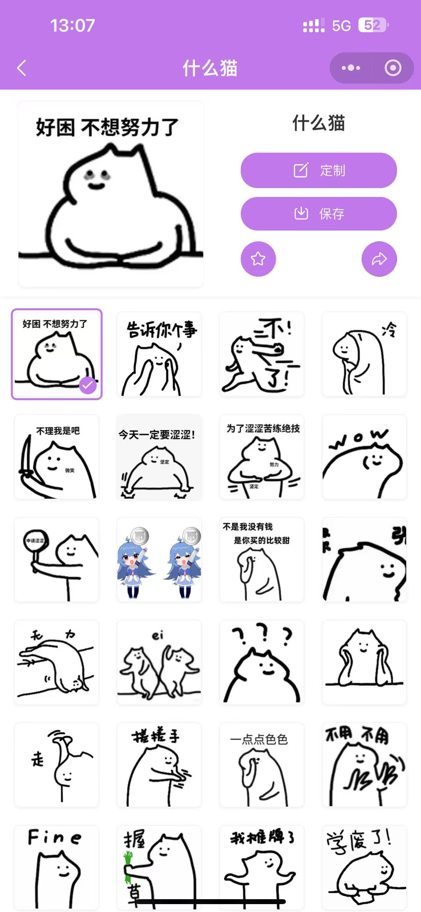
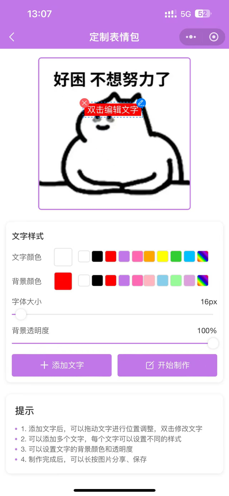

# 非鱼表情包小程序

## 项目介绍

非鱼表情包小程序是一款专注于提供丰富表情包资源的微信小程序。用户可以浏览、收藏、定制、分享各类有趣的表情包，满足日常社交聊天需求。

### 扫码体验

  

  
  
  

感兴趣的可以扫码体验！

## 功能特点

- 🖼️ **丰富表情库**：提供海量表情包资源，分类清晰
- 🔍 **智能搜索**：支持关键词搜索，快速找到想要的表情
- ⭐ **收藏功能**：一键收藏喜欢的表情包，随时使用
- 📤 **便捷分享**：支持一键分享到微信好友
- 🔄 **表情包定制**：定制自己的表情包

## 项目架构
### 前端架构
小程序端：基于 uni-app 开发
管理后台：Vue.js + Element UI，提供完善的内容管理功能，基于若依框架

### 后端架构
基于若依框架

jdk1.8

开发框架：Spring Boot
数据库：MySQL
缓存：Redis
对象存储：本地

## 相关项目

- 🔧 **非鱼表情包小程序项目**：[非鱼表情包小程序](https://github.com/funnywus/feiyu-emoticon-uniapp.git)

- 🖥️ **非鱼表情包后台管理系统**：[非鱼表情包后台管理系统](https://github.com/funnywus/feiyu-emoticon-admin.git)

- 🔧 **非鱼表情包后台API项目**：[非鱼表情包后端API](https://github.com/funnywus/feiyu-emoticon-api.git)

  

## 版本历史

- v1.0.0 - 2025.04.01 - 首次发布

## 联系方式

- 邮箱：funnywus@163.com

## sql 获取方式

需要 sql 请点赞联系作者获取

获取方式(wx，备注非鱼)：wht312376873

## 许可证

本项目使用 MIT 许可证